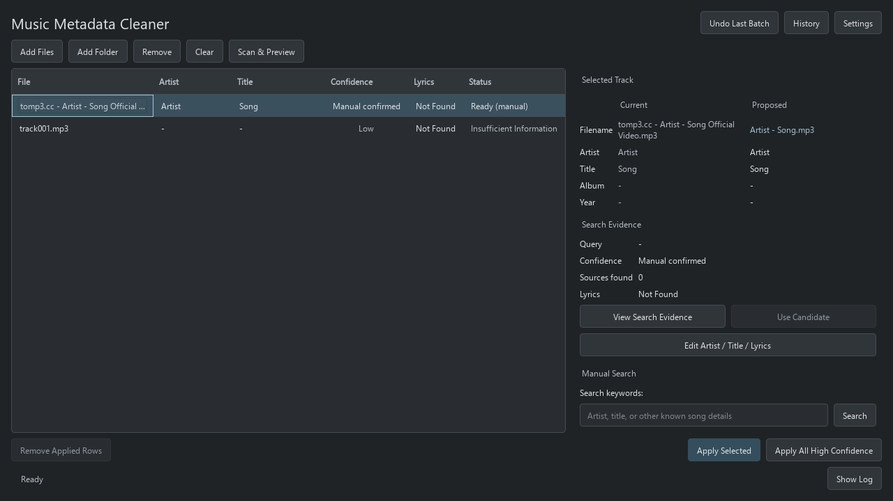
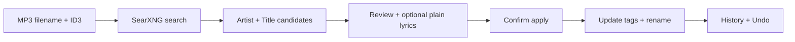

# 🎵 Music Metadata Cleaner

Clean MP3 artist/title tags and filenames with a local desktop app. Review every proposal before changing your files.


*Current dark-theme UI with demonstration data. “Manual confirmed” means the identity was entered by a user.*

## ✨ What it does

- Finds **Artist + Title** using filenames, useful ID3 tags, and **SearXNG** search results.
- Lets you inspect evidence, choose candidates, or edit artist/title using editable dropdowns.
- Retrieves **plain lyrics** from LRCLIB, preserves existing lyrics by default, and accepts manual lyrics.
- Updates ID3 and renames files to **`Artist - Title.mp3`**, with confirmation, backups, history, and undo.

**Text search only:** the app cannot listen to songs. Unclear filenames need manual keywords or editing. Confidence is an evidence rating, not a guaranteed accuracy percentage.



## 🚀 Quick start

Requires **Python 3.10+**, compatible Qt libraries, and a **JSON-enabled SearXNG instance**. From the project folder:

```sh
python -m pip install -r requirements.txt
```

**Windows · PowerShell**

```powershell
$env:PYTHONPATH="$PWD\src"
python -m music_metadata_cleaner
```

**Linux**

```sh
PYTHONPATH=src python -m music_metadata_cleaner
```

In **Settings → Search**, enter your SearXNG base URL, click **Test Connection**, then **Save**. No search API key is needed. Alternatively, set `SEARXNG_URL` in your environment or a `.env` file in the launch folder; it overrides the saved URL. See [setup and troubleshooting](docs/USER_GUIDE.md#connect-search).

## 🧭 Everyday workflow

1. **Add Files** or **Add Folder**.
2. Click **Scan & Preview**. This does not modify MP3s.
3. Select a row to compare **Current / Proposed** and **View Search Evidence**.
4. If needed, use **Search keywords → Search**, **Use Candidate**, or **Edit Artist / Title / Lyrics → Save Preview**.
5. Click **Apply Selected**, or **Apply All High Confidence**, then confirm.
6. Use **History** to inspect changes and **Undo Last Batch** to restore supported tags and filenames.

Missing lyrics do not block metadata cleanup. **Remove**, **Clear**, and **Remove Applied Rows** only remove list entries, not files. [Full user guide →](docs/USER_GUIDE.md)

## 🛠️ Tech stack

| Part | Technology |
| --- | --- |
| Desktop UI | Python, PySide6 / Qt, centralized QSS |
| Search & identity | SearXNG JSON, httpx, deterministic rules |
| Tags & lyrics | Mutagen ID3, LRCLIB plain lyrics |
| History & cache | SQLite, pathlib |
| Tests & packaging | pytest, PyInstaller |

MP3 audio stays local; search text goes to your configured SearXNG server, and lyrics lookups go to LRCLIB. No audio recognition, LLM resolution, paid search API, or synchronized-lyrics export is used.

## 📚 More

[User guide](docs/USER_GUIDE.md) · [Confidence & manual editing](docs/CONFIDENCE_AND_MANUAL_EDIT.md) · [Architecture](docs/ARCHITECTURE.md) · [Build & tests](docs/BUILD.md) · [All documentation](docs/README.md)
