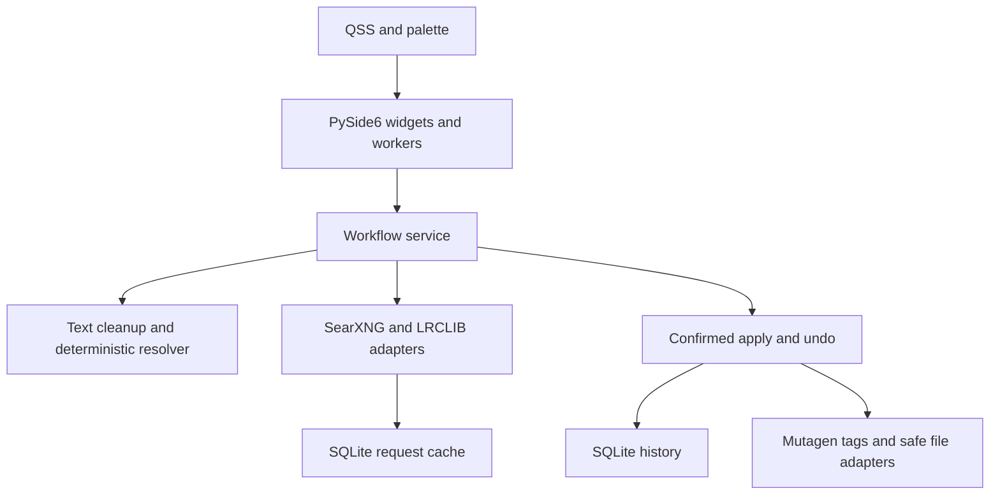

# Architecture — SearXNG text resolution

[Documentation index](README.md) · [User guide](USER_GUIDE.md)

`__main__ → service_factory → MusicCleanerWorkflowService`

The composition root constructs SearXNGProvider, RuleBasedIdentityResolver and LyricsService(LRCLIBClient), together with the existing SQLite and file adapters. No recognition clients or audio executables are initialized.

## Search boundary

SearXNGProvider implements SearchProvider.search(query, count). It sends GET `{base_url}/search?q=...&format=json`; maximum results limits the returned first page locally. It validates the results array, strips HTML markup, normalizes domain/engine/rank fields, and rejects malformed responses. Connection testing bypasses the cache and returns PASS, INVALID_ENDPOINT, SERVER_UNREACHABLE, JSON_FORMAT_DISABLED, TIMEOUT or INVALID_RESPONSE. HTML responses and HTTP 403 are diagnosed as JSON_FORMAT_DISABLED; access controls can also cause 403.

SearchResult contains title, URL, snippet, source_domain, engine and rank. No raw dictionary reaches the resolver or UI. Cache keys include normalized endpoint + query, with a version prefix. TTL defaults to 86400 seconds. Different instances cannot share cached results accidentally. Clearing search cache leaves history and other provider caches intact.

## Queries and parsing

FilenameCleaner removes known downloader prefixes, quality wrappers and unambiguous suffix phrases. Full Moon, Live, Remix, Cover, Acoustic and other recording-version words remain intact. SearchQueryBuilder prefers useful Artist + Title ID3; its second query uses a differing filename or appends song. Manual keywords use the same builder and resolver. Generic numbered tracks and recommendation labels produce no automatic request.

RuleBasedIdentityResolver parses common dash, colon, pipe and `Title by Artist` forms after stripping known site suffixes. It considers reversed pairs but needs explicit syntax, ID3 artist agreement, or artist-first filename support to choose orientation. Unrelated results are rejected. Artist separators normalize for grouping; display values are taken from actual supporting results, preferring original-language evidence and reliable sources. No translation or alias dictionary is used. Snippets are available for human review; automatic parsing currently relies on result titles.

## Deterministic score (0–100, not a probability)

Lyrics availability, lyrics matching, and manually supplied lyrics do **not** contribute to identity confidence. High is not a calibrated accuracy percentage.

- Filename: 25 for artist and title containment; 10 for title only; 5 for artist only.
- ID3: 15 for both fields; 5 for one field.
- Independent publisher agreement: 15 per additional domain after the first, maximum 30.
- Source reliability: best supporting source gives 15 for Spotify, Apple Music, YouTube, SoundCloud or Bandcamp; 10 for Genius, Musixmatch, Last.fm, Discogs or Wikipedia; 3 otherwise.
- Artist/title orientation: 15 for explicit syntax or supporting input evidence.

High = 80–100; Medium = 60–79; Low < 60. High additionally requires at least two independent domains, a credible music source, and full filename or ID3 agreement. Multiple pages/subdomains from one service do not create independent votes. Unverified official-looking domains receive the unknown-domain weight, rather than being trusted by name.

A version mismatch subtracts 25 and caps confidence at Low. Competing plausible identities/versions cap all candidates at Low and require selection. Artist aliases in different languages remain separate unless their literal evidence groups match; original-language support affects ranking/display without declaring hidden equivalence.

## Workflow and safety

WorkflowTrack carries queries, normalized results, candidate identities and review state. A failed retry clears its old proposal. Lyrics are fetched only after High confidence or manual candidate selection. Existing lyrics take precedence unless overwrite is explicitly enabled and preservation disabled. LRCLIB discards non-plain formats before caching and flags missing or mismatched identity fields. Review-marked lyrics are never written.

Manual editing uses `domain/manual_edit.py` to suggest filename fragments, current/proposed tags, and candidates. `workflow_service.manual_edit` validates explicit artist/title and optional plain lyrics, then stages a proposal without network or MP3 writes. An identity change clears automatic identity evidence/score for that proposal and displays **Manual confirmed**; lyrics-only edits retaining the same identity keep its existing score. Replacing existing lyrics requires per-file confirmation. Manually supplied lyrics can be written when online retrieval is off, provided ID3 updating is enabled. Rescanning replaces the staged preview with fresh search results.

The GUI runs batch searches, manual searches, candidate lyrics retrieval and connection testing outside its main thread. Mutation controls are disabled during processing. Apply is separate and requires a confirmation dialog. File changes are recorded in SQLite first; existing backups and target names are exclusive. The rename adapter creates an exclusive hard link then removes the old directory entry, avoiding POSIX overwrite races. Unsupported filesystems fail safely. Failed writes roll back; undo restores supported tags and filename. Full original bytes remain in backups when enabled.

Schema version 1 and existing history remain intact. New preferences use LOCALAPPDATA or XDG_CONFIG_HOME; logs use LOCALAPPDATA or XDG_CACHE_HOME. On first launch existing working-directory preferences/history are adopted without moving data. The shared SQLite file stores durable history and independently expiring request cache rows.

## Desktop presentation

- `ui/main_window.py`: six-column TrackTable, resizable table/detail splitter, Current/Proposed comparison, contextual search/candidate/edit controls, and hidden-by-default messages.
- **Scan & Preview** directly calls `preview_changes`; the duplicate scan wrapper/button was removed. Both apply actions still require explicit confirmation. Remove Applied Rows only removes rows successfully applied through the High-confidence batch action.
- `ui/settings_dialog.py`: General, Search, Lyrics, Files & Safety, Advanced; background endpoint testing. Saving persists preferences; connection testing and cache clearing are immediate actions.
- `ui/manual_edit_dialog.py`: editable dropdowns, field swap, optional lyrics, and Save Preview. No direct file mutation.
- `ui/text_dialog.py`: common resizable read-only evidence/history dialog, preserving evidence details and the 25-operation history display.
- `ui/theme.py` and `ui/styles/app.qss`: one QApplication stylesheet and palette, system font, shared spacing, semantic widget roles, and UI-only runtime text colors. The PyInstaller spec packages QSS and SVG control arrows. Backend modules contain no style rules.

## Boundaries retained for compatibility

Historical recognition modules are not in the production import graph. Their tests continue to run against explicitly historical orchestration. Old domain fields remain for serialization/backward compatibility; none drive the new search workflow. See [Phase 9 report](PHASE9_REPORT.md) for the cleanup audit, [UI polish report](UI_POLISH_REPORT.md) for presentation validation, and [benchmark](SEARCH_BENCHMARK.md) for measured resolution limits.
