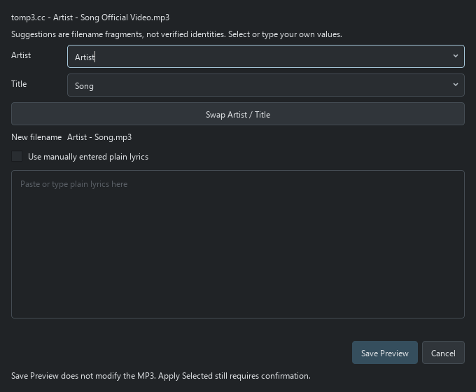

# Confidence 与手动编辑说明

[文档目录](README.md) · [完整操作指南](USER_GUIDE.md) · [真实测试记录](SEARCH_BENCHMARK.md)

Confidence 是确定性规则的证据分数，不是经过统计校准的正确概率。High 不代表保证识别正确，也不代表 99%。歌词是否存在、歌词匹配度、手动输入歌词均不参与身份评分。

| 指标 | 分数 | 规则 |
|---|---:|---|
| 文件名匹配 | 0–25 | 歌手和歌名都包含 25；仅歌名 10；仅歌手 5 |
| 现有 ID3 | 0–15 | 两者一致 15；只有一者一致 5 |
| 独立来源一致性 | 0–30 | 第一来源之后每增加一个域名 15，最多 30；同网站多页面不重复加分 |
| 来源可信度 | 3/10/15 | 主流音乐平台 15；音乐参考网站 10；未知网站 3，取支持来源中的最高值 |
| 方向判断 | 0–15 | 明确 by 格式、ID3 歌手一致、或文件名以歌手开头提供方向依据 |

High ≥80，Medium 60–79，Low <60。High 另外要求至少两个独立来源、可信音乐来源，以及完整文件名或 ID3 支持。版本不一致扣 25 且最多 Low；多个候选存在时也统一限制为 Low。这些规则仍需改进：噪声造成的假候选也可能把正确候选降级。

RuleBasedIdentityResolver 依次执行：清除可识别网站后缀 → 解析 Artist - Title、Title by Artist、冒号和竖线等格式 → 归一化 Unicode/空格/大小写及合作歌手分隔符 → 按歌手和标题分组 → 过滤缺少输入依据或方向依据的结果 → 统计来源并打分 → 检查版本和候选冲突。它不分析音频、不调用 LLM、不推断翻译别名；目前自动提取主要使用搜索结果标题，snippet 留供人工查看。

已知问题：MONTERO (Call Me By Your Name) 中的 by 会误触发格式解析；中文歌词尾部、网站装饰和过长精确查询会降低识别率。当前应用已提供人工完成路径，后续 UI 整理没有更改自动评分公式，也没有声称自动成功率已提高至 99%。

## 当前界面操作

**Add Files / Add Folder → Scan & Preview → 选择歌曲 → 检查 Current / Proposed。** Scan 和 Preview Changes 已合并为同一个按钮；扫描只生成预览，不修改 MP3。

- **View Search Evidence**：查看查询、独立来源、候选与分数明细。
- **Search keywords → Search**：输入已知线索重新搜索当前选中歌曲；也可按 Enter。它不是直接编辑标签。
- **Use Candidate**：明确选择已有搜索候选；候选本来的分数不会因此伪装成 High。
- **Edit Artist / Title / Lyrics**：不依赖搜索结果，直接提供你确认的内容。

## 手动编辑

选择歌曲 → Edit Artist / Title / Lyrics。Artist 和 Title 都是可编辑下拉框，提供当前预览、现有 ID3、搜索候选和原文件名片段。可以交换两栏，也可以直接输入。片段仅为建议，不会被自动当作身份。

输入 Artist 和 Title 后会显示新文件名。勾选 Use manually entered plain lyrics 可粘贴歌词；已有歌词默认保留，替换必须勾选该文件的确认项。保存只生成预览；Apply Selected 仍要求确认，并保留历史、备份和 Undo。

改变身份时显示 Manual confirmed，不伪造 High 分数；只编辑歌词时保留原有身份分数。即使关闭在线歌词获取，明确输入的手动歌词仍可在启用 ID3 更新的情况下写入。歌词列只显示 Found / Not Found；错误匹配的在线歌词不写入。

要验证 99% 应分别衡量自动身份准确率、自动覆盖率、以及人工辅助完成率，并使用经人工核对且未用于调参的更多样本。15 首不足以证明泛化后的 99%，手动完成的歌曲也不应算作自动识别成功。

## 验证现状

2026-09-17 的 15 首真实文件测试已经完成：2 High、0 Medium、13 Low，全部原文件哈希保持不变。没有独立核对的标准答案，因此准确性字段仍为 Unverified。当前 203 个通过的测试证明已覆盖行为符合断言，并不代表自动识别准确率达到 99%。

Lyrics 的 Found / Not Found 只描述当前可用歌词；Not Found 也可能是未获取或请求失败，并不证明网上不存在歌词。重新 Scan & Preview 会生成新搜索预览，可能替换尚未应用的人工编辑。
